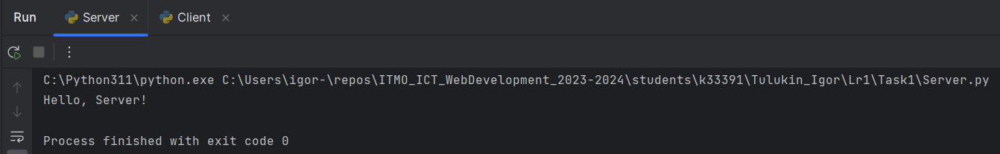

# Задание 1

**Задача**: Реализовать клиентскую и серверную часть приложения. Клиент отсылает серверу
сообщение «Hello, server». Сообщение должно отразиться на стороне сервера.
Сервер в ответ отсылает клиенту сообщение «Hello, client». Сообщение должно
отобразиться у клиента.

**Листинг кода**:<br/>

``` py title="Server.py"
import socket

sock = socket.socket(family=socket.AF_INET, type=socket.SOCK_DGRAM)
sock.bind(('', 9090))

while True:
    data = sock.recvfrom(1024)
    if not data:
        break
    print(data[0].decode("utf-8"))
    sock.sendto(b'Hello, Client!', data[1])
    break
```

``` py title="Client.py"
import socket

sock = socket.socket(family=socket.AF_INET, type=socket.SOCK_DGRAM)
sock.connect(('localhost', 9090))
sock.send(b'Hello, Server!')

data = sock.recv(1024)
sock.close()

print(data.decode('utf-8'))

```

**Результат работы программы**:

