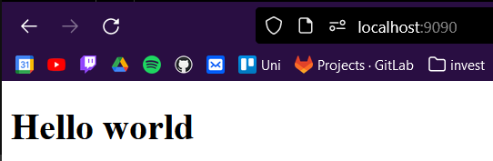

# Задание 3

**Задача**: Реализовать серверную часть приложения. Клиент подключается к серверу. В ответ
клиент получает http-сообщение, содержащее html-страницу, которую сервер
подгружает из файла index.html.

**Листинг кода**:<br/>

``` html title="page.html"
<!DOCTYPE html>
<html lang="en">
  <head>
    <title>Page</title>
  </head>
  <body>
    <h1>Hello world</h1>
  </body>
</html>
```

``` py title="Server.py"
import socket

sock = socket.socket(socket.AF_INET, socket.SOCK_STREAM)
sock.bind(('', 9090))
sock.listen(10)

while True:
    connection, address = sock.accept()
    data = connection.recv(16384)
    header = 'HTTP/1.1 200 OK\n'
    mimetype = 'text/html'
    header += 'Content-Type: ' + str(mimetype) + '\n\n'
    file = open('page.html', 'rb')
    response = file.read()
    file.close()
    final_response = header.encode('utf-8')
    final_response += response
    connection.send(final_response)
    connection.close()


```

**Результат работы программы**:
