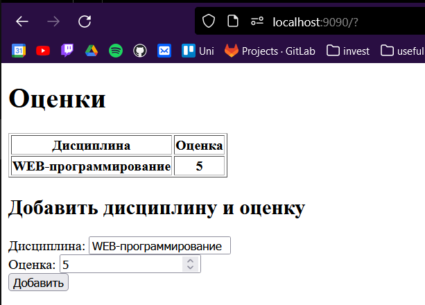

# Задание 4

**Задача**: Необходимо написать простой web-сервер для обработки GET и POST http
запросов средствами Python и библиотеки socket.

**Листинг кода**:<br/>

``` py title="Server.py"
import socket
import json


class MyHTTPServer:
    def __init__(self, host, port):
        self.host = host
        self.port = port
        self.grades = {}

    def serve_forever(self):
        server_socket = socket.socket(socket.AF_INET, socket.SOCK_STREAM)
        server_socket.bind((self.host, self.port))
        server_socket.listen(10)
        while True:
            client_socket, addr = server_socket.accept()
            self.serve_client(client_socket)

    def serve_client(self, client_socket):
        data = client_socket.recv(1024).decode('UTF-8')
        try:
            response = self.parse_request(data)
            if response:
                client_socket.send(response)
        except Exception as e:
            error_msg = "HTTP/1.1 400 Bad Request\n\n"
            client_socket.send(error_msg.encode('utf-8'))
        finally:
            client_socket.close()

    def parse_request(self, data):
        lines = data.split('\r\n')
        headers = lines[0].split()
        print(f"Headers : {headers}")
        if len(headers) != 3:
            raise Exception("Bad request line")
        body = lines[-1]
        if headers[0] == "GET":
            return self.handle_get()
        elif headers[0] == "POST":
            return self.handle_post(body)
        else:
            raise Exception("There is no such method")

    def handle_get(self):
        file = open('head.html', 'rb')
        html = file.read()
        response = "HTTP/1.1 200 OK\n\n"
        response = response.encode('UTF-8')
        response += html
        for k, v in self.grades.items():
            response += f"<tr><th>{k}</th><th>{v}</th></tr>".encode('UTF-8')
        file = open('end.html', 'rb')
        html = file.read()
        response += html
        return response

    def handle_post(self, body):
        body = json.loads(body)
        self.grades[body['discipline']] = body['grade']
        response = "HTTP/1.1 200 OK\n\n"
        response = response.encode('UTF-8')
        return response


if __name__ == '__main__':
    host = "localhost"
    port = 9090
    serv = MyHTTPServer(host, port)
    try:
        serv.serve_forever()
    except KeyboardInterrupt:
        pass

```

``` html title="head.html"
<!DOCTYPE html>
<html lang="ru">
<head>
    <meta charset="UTF-8">
    <title>Оценки</title>
</head>
<body>
    <h1>Оценки</h1>
    <table border="1">
        <thead>
            <tr>
                <th>Дисциплина</th>
                <th>Оценка</th>
            </tr>
        </thead>
        <tbody id="grades-table">
```
``` html title="head.html"

        </tbody>
    </table>
    <h2>Добавить дисциплину и оценку</h2>
    <form id="add-form" onsubmit="submitFormFetch()">
        <label>Дисциплина:</label>
        <input type="text" id="discipline" required><br>
        <label>Оценка:</label>
        <input type="number" id="grade" min="1" max="5" required><br>
        <input type="submit" value="Добавить">
    </form>

    <script>
        function submitFormFetch(event) {
         let name = document.getElementById('discipline').value
            let grade = document.getElementById('grade').value
            console.log(name, grade)
            let body = {
                   discipline: name,
                   grade: grade
               }

         fetch('http://localhost:9090', {
               method: "POST",
             body: JSON.stringify(body)
            })
            .catch((err) => {
               alert(err);
            });
         return false;
      }
    </script>
</body>
</html>
```

**Результат работы программы**:


