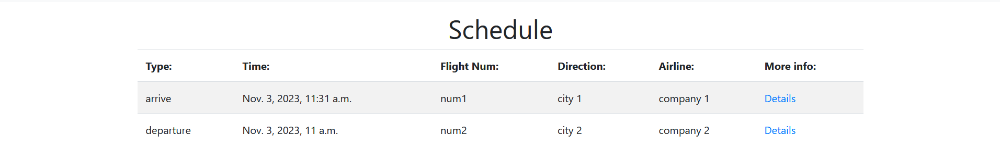

# Templates

**Задача**: Реализовать html страницы для отображения данных

Base.html включает в себя "шапку" сайта, а так же загружает библиотеку bootstrap для ускорения написания html страниц и придания лучшего вида

``` html title="base.html"
<!DOCTYPE html>
<html lang="en">
<head>
    <meta charset="UTF-8"/>
    <meta name="viewport" content="width=device-width, initial-scale=1.0"/>
    <title>Airport</title>
    <link rel="stylesheet" href="https://stackpath.bootstrapcdn.com/bootstrap/4.3.1/css/bootstrap.min.css"
          integrity="sha384-ggOyR0iXCbMQv3Xipma34MD+dH/1fQ784/j6cY/iJTQUOhcWr7x9JvoRxT2MZw1T" crossorigin="anonymous">

  <body>
    <nav class="navbar navbar-expand-lg navbar-light bg-light">
        <div class="collapse navbar-collapse" id="navbarSupportedContent">
            <a class="nav-link active" aria-current="page" href="">Schedule</a>
            
            <a class="nav-link active" aria-current="page" href=""> Your Tickets</a>
            

          <div class="d-flex gap-2">
            
              <a href="">
                <button class="btn btn-outline-danger" type="submit">Logout</button>
              </a>
            
              <a href="">
                <button class="btn btn-outline-primary" type="submit">Login</button>
              </a>
              <a href="">
                <button class="btn btn-outline-primary" type="submit">Register</button>
              </a>
            
          </div>
        </div>
    </nav>

<div class="container py-3">
   

</div>
</body>
</html>
```


``` html title="buy_ticket.html"
 
<h2>Seats</h2>
<table class="table table-striped table-hover mb-5">
    
    <td class="text-center">
         <s style="color:grey;">{{seat.name}}</s>
         {{seat.name}}
        
    </td>
    
</table>

<div class="row">
    <div class="col-md-3">
        <form method="post">
            
            <div class="mb-3">
                <label for="ticketSeatInput" class="form-label">Seat: </label>
                <input name='seat' class="form-control" id="ticketSeatInput">
            </div>
            <button type="submit" class="btn btn-primary">Submit</button>
        </form>
    </div>
</div>

```


``` html title="flight_detail.html"
 

<h1>Flight {{flight.name}}</h1>

<br>

<h2 class="mb-3">Information about flight</h2>
<div>Type: {{ flight.type }}</div>
<div>Flight number: {{ flight.flight_number }}</div>
<div>Airline: {{ flight.air_line }}</div>
<div>Destination: {{ flight.destination }}</div>
<div>Time: {{ flight.time }}</div>
<div>Gate: {{ flight.gate }}</div>

<br>
<br>

<h2>Passengers already registered</h2>
<div class="mb-4">
    
    <table class="table table-striped table-hover">
        <thead>
        <tr>
            <th scope="col">Username</th>
            <th scope="col">Seat</th>
        </tr>
        </thead>

        <tbody>
        
        <tr>
            <td class="align-middle">{{ticket.passenger.username}}</td>
            <td class="align-middle">{{ticket.seat}}</td>
        </tr>
        
        </tbody>
    </table>
        
        All seats are free now.
    
        <br>
        <br>
</div>


<h3> You can buy a ticket <a href=""> here</a><h3>
    <div>
        
        <td>You already have a<a href="" > ticket</a> on these flight</td>
        
        
        If you want to buy a ticket, you should be <a href=""> registered</a>
        
        <br>
        <br>
    </div>


<h2 class="my-3">Comments</h2>


<ul class="list-group">
    
    <li class="list-group-item">
        <strong>{{ comment.writer.username }}</strong>
        <br>
        Rating: {{ comment.rating }}
        <br>
        {{ comment.message }}
    </li>
    
</ul>

No comments were left
<br>
<br>




<h5 class="my-3">Add comment</h5>
<form method="post" class="mb-5">
    
    {{ comment_form.as_p }}
    <button type="submit" class="btn btn-primary">Add</button>
</form>





```


``` html title="flight_list.html"
 

<h1 class="text-center">Schedule</h1>

<table class="table table-striped table-hover mb-5">
  <thead>
    <tr>
      <th scope="col">Type:</th>
      <th scope="col">Time:</th>
      <th scope="col">Flight Num:</th>
      <th scope="col">Direction:</th>
      <th scope="col">Airline:</th>
      <th scope="col">More info:</th>
    </tr>
  </thead>

  <tbody>
    
      <tr>
        <td>{{flight.type}}</td>
        <td>{{flight.time}}</td>
        <td>{{flight.flight_number}}</td>
        <td>{{flight.destination}}</td>
        <td>{{flight.air_line}}</td>
        <td><a href="">Details</a></td>
      </tr>
    
  </tbody>
</table>


```


``` html title="login.html"
 

<h2 class="mb-3">Sign in</h2>
<form method="post" class="mb-3">
    
    {{ form.as_p }}
    <button type="submit" class="btn btn-primary">Sign in</button>
</form>

```


``` html title="register.html"
 

<h2 class="mb-4">Registration</h2>
<form method="post" class="mb-3">
    
    {{ user_form.as_p }}
    <button type="submit" class="btn btn-primary">Register</button>
</form>
<p>Already have a profile? <a href="" class="text-primary">Login</a></p>



```


``` html title="ticket_delete.html"
 

<a href="" class="btn btn-secondary mb-4">Back to flight</a>

<h2>Delete ticket</h2>
<h5 class="my-3">Information about ticket</h5>
<div>Seat: {{ ticket.seat }}</div>
<div>Ticket: {{ ticket.ticket_number }}</div>

<form method="POST" class="mt-3">
    
    <p>Are you sure you want to delete ticket?</p>

    <button type="submit" class="btn btn-danger">Delete</button>
</form>


```


``` html title="ticket_for_user.html"
 

<h2 class="mb-4">Your tickets</h2>
<table class="table table-bordered">
    <thead class="thead-light">
    <tr>
        <th scope="col">Seat</th>
        <th scope="col">Ticket</th>
        <th scope="col">Flight</th>
        <th scope="col">FlightLink</th>
    </tr>
    </thead>
    <tbody>
    
    <tr>
        <td>{{ ticket.seat}}</td>
        <td>{{ ticket.number}}</td>
        <td>
            <div>Flight number: {{ ticket.seat.flight.flight_number }}</div>
            <div>Airline: {{ ticket.seat.flight.air_line }}</div>
            <div>Destination: {{ ticket.seat.flight.destination }}</div>
            <div>Time: {{ ticket.seat.flight.time }}</div>
            <div>Gate: {{ ticket.flight.gate }}</div>
        </td>
        <td><a href="" class="btn btn-primary">More</a></td>
        <td><a href="" class="btn btn-primary">Change</a></td>
    </tr>
    
    </tbody>
</table>


```


``` html title="ticket_update.html"
 

<a href="" class="btn btn-secondary mb-4">Back to flight</a>

<h2>Change seat</h2>
<h5 class="my-3">Information about ticket</h5>
<div>Old seat: {{ ticket.seat }}</div>
<div>Ticket: {{ ticket.ticket_number }}</div>

<form method="POST" class="mt-3">
    
    {{ form.as_p }}

    <button type="submit" class="btn btn-primary">Save changes</button> <a href="" class="btn btn-primary"> or Delete</a>
</form>



```

